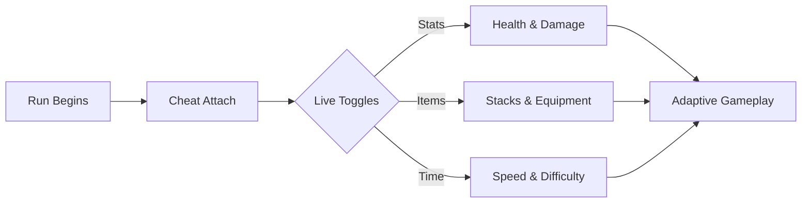

# Risk of Rain 2 Cheat

The rain never stops—it only accelerates. Enemies bloom like thunderheads, time sharpens its teeth, and every run becomes a question asked louder than the last. In **Risk of Rain 2**, this cheat is not an escape hatch. It’s a tuning dial, cool metal under your fingers.

Not to silence the storm.
To decide how fiercely it sings.

---

## 🌩️ Overview — Control Without Breaking the Run

The **Risk of Rain 2 Cheat** is a compact PC tool built for live, reversible control. It attaches cleanly, alters nothing permanent, and lets you bend core systems—health, damage, items, time—while the run breathes on.

Made for:

* High-difficulty practice without endless resets
* Build experimentation without waiting on RNG
* Accessibility pacing and learning curves
* Sandbox runs and content creation

Flip a switch. Learn. Flip it back. The rain remembers nothing.

---

## 🎯 Core Cheat Features — Shape the Chaos

Every function is modular and hotkey-driven. Use one. Use none. Use all.

### 🛡️ Survival & Power

* **God Mode / Health Lock** – Study bosses without punishment
* **Shield & Regen Control** – Tune survivability precisely
* **Damage Multiplier** – From subtle edge to cosmic force

### 🎒 Items & Builds

* **Item Spawner** – Add any item instantly
* **Stack Editor** – Test scaling without grind
* **Equipment Cooldown Reset** – Chain effects freely

### ⏱️ Time & Difficulty

* **Freeze Difficulty Scaling** – Pause escalation mid-run
* **Game Speed Slider** – Slow the storm or unleash it
* **Director Cost Control** – Shape enemy density

### 🏃 Movement & Skills

* **Infinite Sprint / Jump** – Traverse without friction
* **Skill Cooldown Toggle** – Ability-first combat
* **One-Hit Mode** – Precision practice when timing matters

---

## ⚡ Setup — As Fast as Lightning

No installers. No background services. Just a clean attach.

### Steps

1. Launch *Risk of Rain 2*
2. Run the cheat as administrator
3. Click **Attach** when detected
4. Toggle features live during the run

### Sample Hotkeys

```text
F1 – God Mode
F2 – Add Item
F3 – Freeze Difficulty
F4 – Game Speed
```

> [!IMPORTANT]
> Disable extreme values before ending a run to preserve natural progression metrics.

---

## 🧠 How the Cheat Touches the Run



Close the tool—and the planet resumes its indifferent rhythm.

---

## ❓ FAQ — Clear Skies, Honest Answers

**Does it modify save files?**
No. All effects are runtime-only.

**Performance impact?**
Minimal. Lightweight memory footprint.

**Can I revert changes mid-run?**
Instantly. Every toggle is reversible.

**Controller-friendly?**
Yes. Hotkeys coexist cleanly with controller input.

**Update cadence?**
Aligned with major patches for quick compatibility.

---

## 🌌 Final Thoughts

Risk of Rain 2 is a spiral—beautiful, merciless, accelerating. This cheat doesn’t flatten that spiral; it gives you a handhold. A moment to breathe, to test, to learn, to dance longer in the downpour.

When you’re ready, release the keys.
Let the rain decide again.
